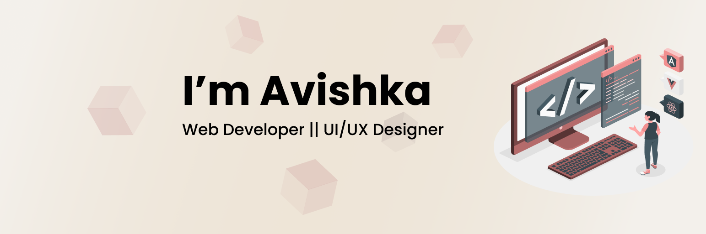

<link rel="preconnect" href="https://fonts.gstatic.com">
<link href="https://fonts.googleapis.com/css2?family=Poppins:wght@400;500;600;700&display=swap" rel="stylesheet">

Hey, I am Avishka

   I am a Web Developer and interested in front end development and UI Designing. Checkout my portfolio to know more about me <a href="https://avishka24.github.io/"> Here ></a>

<table width="100%">
  <tr>
    <td>
 </td>
 <td>  </td>
  </tr>
 <table>
  
